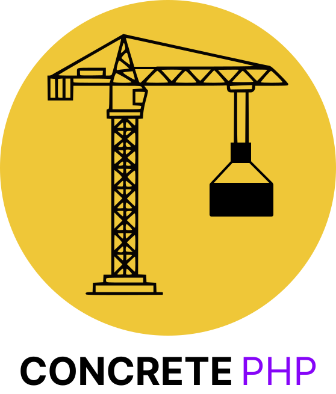

<p align="center">
  
</p>

<h1 align="center">ConcretePHP — Service Layer & DTO Abstractions</h1>

<p align="center">
  <a href="https://packagist.org/packages/alvarez/concrete-php">
    
  </a>
  
  
</p>

<p align="center">
  A lightweight, pragmatic set of abstractions to organize business logic in Laravel:
  a minimal <strong>Service Layer</strong> (<code>AbstractModelService</code>) and a compact
  <strong>DTO</strong> system (<code>AbstractDTO</code>).
</p>

---

## Table of Contents

1. Overview
2. Features
3. Requirements
4. Installation
5. Quick Start (Examples)
6. Deep Dive — API Reference

   * `AbstractDTO`
   * `AbstractModelService`
   * `IsDTO` contract
7. Behavior & Implementation Notes (the "magic")
8. Extending & Customization
9. Testing (outside Laravel)
10. Best Practices
11. Packagist / Composer Publishing Tips
12. Contributing
13. Changelog
14. License

---

## 1. Overview

ConcretePHP focuses on two complementary building blocks:

* **DTOs (Data Transfer Objects)** — `AbstractDTO` gives you a small, serializable object model for carrying validated data between layers.
* **Service Layer** — `AbstractModelService` wraps an Eloquent model instance and centralizes create/find/update operations while accepting DTOs or arrays.

This combination reduces coupling between HTTP layer and persistence, makes unit-testing trivial, and keeps your controllers focused on request/response logic.

---

## 2. Features

* Accept DTOs or arrays uniformly when creating/updating records.
* Fluent interface for updating / setting records.
* Built-in helpers for DTO serialization (`toArray`, `toJson`, `fromArray`, `fromJson`), filtering (`except`) and immutability-like cloning (`cloneWith`).
* Sensible convention: `UserService` → `App\Models\User` (pluggable by overriding `getModelPath`).
* Lightweight — no repository abstractions, no heavy DI required.

---

## 3. Requirements

* PHP 8.0 or later (union types and `static` return types are used)
* Laravel 8+ (for typical usage), or `illuminate/database` if you want to use Eloquent standalone.

---

## 4. Installation

```bash
composer require alvarez/concrete-php
```

If you plan to run tests or use the package outside Laravel, install Eloquent components:

```bash
composer require illuminate/database
```

---

## 5. Quick Start (Examples)

### DTO Definition

```php
use Alvarez\ConcretePhp\Data\AbstractDTO;

final class CreateUserDTO extends AbstractDTO
{
    public function __construct(
        public string $name,
        public string $email,
        public string $password,
    ) {}
}
```

### Service Definition

```php
use Alvarez\ConcretePhp\Services\AbstractModelService;

class UserService extends AbstractModelService
{
    // Add domain-specific helpers here (e.g., changePassword, activate, archive)
}
```

### Create a User (DTO or array)

```php
$dto = new CreateUserDTO(name: 'Jane', email: 'jane@example.com', password: bcrypt('secret'));
$userService = UserService::create($dto);

// or
$userService = UserService::create([
    'name' => 'Jane',
    'email' => 'jane@example.com',
    'password' => bcrypt('secret'),
]);
```

### Find, Update, and Access Model

```php
$service = UserService::find(1); // findOrFail under the hood
$service->update(['name' => 'Jane Updated']);
$user = $service->getRecord(); // Eloquent model
```

---

## 6. Deep Dive — API Reference

### `Alvarez\ConcretePhp\Contracts\IsDTO`

```php
interface IsDTO
{
    public function toArray(): array;
    public static function fromArray(array $data): static;
    public function toJson(): string;
    public static function fromJson(string $json): self;
}
```

This contract ensures DTOs can be converted to/from arrays and JSON. Services rely on `toArray()` to persist DTO data.

### `Alvarez\ConcretePhp\Data\AbstractDTO`

Public methods provided:

* `public static function fromArray(array $data): static` — Creates a DTO instance from an array using `new static(...$data)`.
* `public function toArray(): array` — Returns an associative array of the DTO’s public properties using `get_object_vars($this)`.
* `public function except(array $keys): array` — Returns DTO properties, excluding the provided keys.
* `public function cloneWith(array $values): static` — Returns a *new* DTO instance with merged values (original remains unchanged).
* `public static function fromJson(string $json): static` — Create DTO from JSON string.
* `public function toJson(): string` — Convert DTO to JSON string.

**Notes & caveats**

* `fromArray` uses the argument unpacking operator (`...$data`) to pass array values to the DTO constructor. This means the order of values matters — the array must provide values in the same order as the constructor parameters. If you prefer keyed mapping, build DTO instances manually or implement a small factory.
* `toArray()` returns *public* properties only. If you use protected/private fields in a derived DTO, they won't be part of the serialized form.

### `Alvarez\ConcretePhp\Services\AbstractModelService`

Public methods provided:

* `public static function create(array|IsDTO $data): static` — Create a new model record and return a Service instance that wraps it. Accepts either a DTO (calls `toArray()`), or a plain array.
* `public static function find(string|int $id): static` — Uses `findOrFail` on the resolved model path and returns a Service wrapping the model.
* `public function update(array|IsDTO $data): static` — Update the internal model with data from an array or DTO, and return `$this` for chaining.
* `public function getRecord(): Model` — Get the underlying Eloquent model instance.
* `public function setRecord(Model $record): static` — Replace the stored model instance — returns `$this`.
* `public static function getModelPath(): string` — Resolve the Model FQN by convention. Defaults to `App\Models\{ModelName}` derived from service class name.

**Behavior details**

* When `create()` is called with a DTO, `create($data->toArray())` will be executed on the resolved Eloquent model class. For arrays, `create($data)` is executed directly.
* `find()` uses `findOrFail()` to surface `ModelNotFoundException` when the record is absent (this maps to a 404 in HTTP contexts when using Laravel's exception handler).
* `update()` delegates to Eloquent's `update()` method on the stored model instance.

---

## 7. Behavior & Implementation Notes (the "magic")

These are the small, opinionated choices that make ConcretePHP feel *magical* and at the same time predictable — and why they matter:

* **Constructor-wrapped Model**: `AbstractModelService` stores a single Eloquent model instance. This makes services lightweight stateful wrappers — ideal for per-request domain operations.

* **DTO-first flow**: Services accept DTOs and arrays interchangeably. Passing DTOs clarifies intent and ensures you work with validated, explicit contracts before touching persistence.

* **Convention-based model resolution**: `getModelPath()` extracts the service class basename and removes the `Service` suffix. `UserService` → `App\Models\User`. Override it if your models live elsewhere or use a different naming scheme.

* **Fluent API & `static` return types**: Methods return `static` so child service classes preserve fluent chaining and typing.

* **Immutability-friendly DTOs**: `cloneWith()` returns a new instance — original DTOs remain unchanged, which helps reasoning about state when composing domain operations.

* **Testing-friendly**: The service layer is pure PHP and touches Eloquent only through the Model instance — which means you can inject mocked or in-memory models for unit tests.

## 8. Extending & Customization

### Overriding model path

If your models live outside `App\Models`, or you want to point to a mock in tests, just override `getModelPath()`:

```php
public static function getModelPath(): string
{
    return Task::class; // or 'App\\MyModels\\Task'
}
```

### Add domain methods

A service should contain domain-specific operations, not just CRUD helpers:

```php
class UserService extends AbstractModelService
{
    public function activate(): static
    {
        $this->getRecord()->update(['active' => true]);
        return $this;
    }

    public function changePassword(string $password): static
    {
        $this->getRecord()->update(['password' => bcrypt($password)]);
        return $this;
    }
}
```

### Validation & Form Requests

Keep validation responsibility in Form Requests (or a validation layer) and pass a DTO into the service. This keeps the service focused on business logic and persistence.

---

## 9. Testing (outside Laravel)

The repository includes example tests which demonstrate how to bootstrap Eloquent in-memory via `Illuminate\Database\Capsule\Manager` (useful for package tests or library CI):

* Boot Eloquent with an in-memory SQLite DB.
* Create test schema using `Capsule::schema()->create(...)`.
* Define a small mock model (with `$fillable`) and a concrete Service class that overrides `getModelPath()` to return the mock model class.

Example (conceptual):

```php
$capsule = new Capsule;
$capsule->addConnection(['driver' => 'sqlite','database' => ':memory:']);
$capsule->setAsGlobal();
$capsule->bootEloquent();

Capsule::schema()->create('tasks', function (Blueprint $t) { $t->id(); $t->string('title'); $t->timestamps(); });

class Task extends Model { protected $fillable = ['title']; }
class TaskService extends AbstractModelService { public static function getModelPath(): string { return Task::class; } }

// Then use TaskService::create([...]) and assertions as in the package tests.
```

This pattern is included in the test-suite so Continuous Integration can verify package behavior without a full Laravel app.

---

## 10. Best Practices

* Prefer DTOs over raw arrays when passing input to services.
* Keep services focused: orchestrate domain logic and talk to models — do not implement HTTP concerns.
* Use Form Requests (or a Validator) to return validated data before creating DTOs.
* Override `getModelPath()` in tests for deterministic behavior.
* When using `AbstractDTO::fromArray`, ensure the input array values follow the constructor parameter order.

---

## 11. Packagist / Composer Publishing Tips

Suggested `composer.json` excerpt for the package root:

```json
{
  "name": "alvarez/concrete-php",
  "description": "Lightweight Service Layer and DTO helpers for Laravel and Eloquent",
  "type": "library",
  "license": "MIT",
  "require": {
    "php": "^8.0",
    "illuminate/database": "^9.0|^10.0"
  },
  "autoload": {
    "psr-4": {
      "Alvarez\\ConcretePhp\\": "src/"
    }
  }
}
```

* Tag releases semantically (v1.0.0, v1.1.0).
* Add a `CHANGELOG.md` and keep it updated.

---

## 12. Contributing

Contributions are welcome!

* Open issues for bugs or feature requests.
* Send PRs against `main`.
* Keep changes small and focused, and include tests for new behavior.

Suggested CI checks:

* PHPUnit tests
* Static analysis (Psalm/Phan)
* PHPStan level 7+

---

## 13. Changelog

See `CHANGELOG.md` for details. Keep the first release note brief:

* `v1.0.0` — Initial release: `AbstractDTO`, `AbstractModelService`, contract and basic tests.

---

## 14. License

MIT — see `LICENSE` for full text.

---

If you want, I can:

* Produce a shorter `README.md` suitable for Packagist’s limited preview.
* Generate a `composer.json` complete file ready for publishing.
* Add ready-to-copy badges and GitHub templates (issue template, PR template).
* Create `CHANGELOG.md` or `CONTRIBUTING.md` files.

Tell me which of the above you want next and I’ll add them directly to the repository content.
